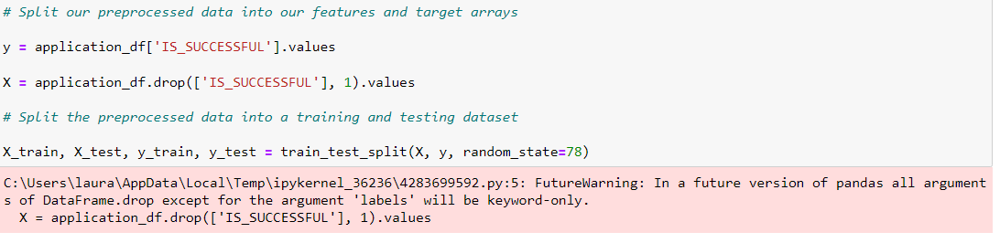
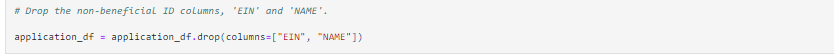
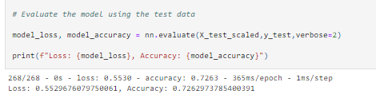

# Neural_Network_Charity_Analysis - Challenge Number 19 

## Overview of the Analysis

The purpose of this analysis was to assist Alphabet Soup, a philanthropic organization with ensuring that the donations received and then given to organizations is used effectively.  As part of the analysis, we reviewed a large CSV file that contained data for donations received by Alphabet Soup.  We were then tasked with working through various machine learning models to achieve   

## Results

## Data Preprocessing

***

* What variable(s) are considered the target(s) for your model?

  The variable that I considered the target for my model was the "IS_SUCCESSFUL" column as it measures the accuracy of the model.

* What variable(s) are considered to be the features for your model?

  The variables that I considered to be the features of the model were the "AFFILIATION", "CLASSIFICATION", "USE_CASE", "ORGANIZATION", "STATUS", "INCOME_AMT",         "SPECIAL_CONSIDERATIONS", "ASK_AMT" and lastly the "IS_SUCCESSFUL" columns.  

* What variable(s) are neither targets nor features, and should be removed from the input data?

  In my opinion, the values that are neither targets or features, would be the "EIN" and "NAME" columns.  

## Compiling, Training, and Evaluating the Model

*** 

* How many neurons, layers, and activation functions did you select for your neural network model, and why?

  I selected to do two layers with 80 nuerons for layer 1 and 30 for layer 2.  I selected the relu and sigmoid functions as combined with the neurons and layers,
  they seemed to produce the greatest accuracy.  

* Were you able to achieve the target model performance?

  I considered the model to be successful as it achieved about 72%.
  
  

* What steps did you take to try and increase model performance?

  In order to increase model performance, I changed the epochs and also the nuerons and the function.  

## Summary 

  In conclusion, my first neural network model appeared to be more successful than my second attempt using the random forest model.  Based upon what I have learned,     the machine learning model you decide to go with largely depends upon the type of data you are evaluating and how big the data set is.  Different models fit           different types of data.   
